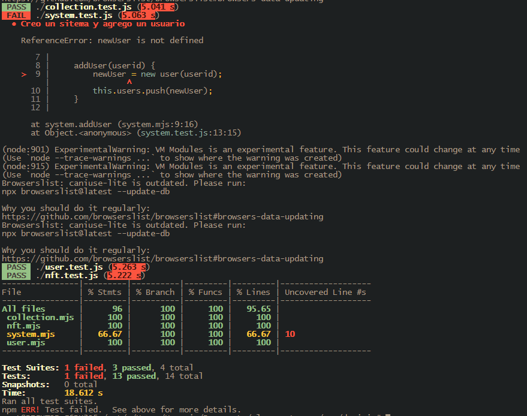
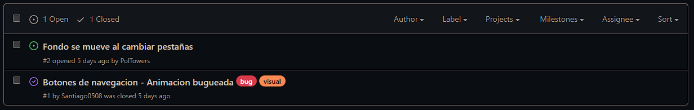
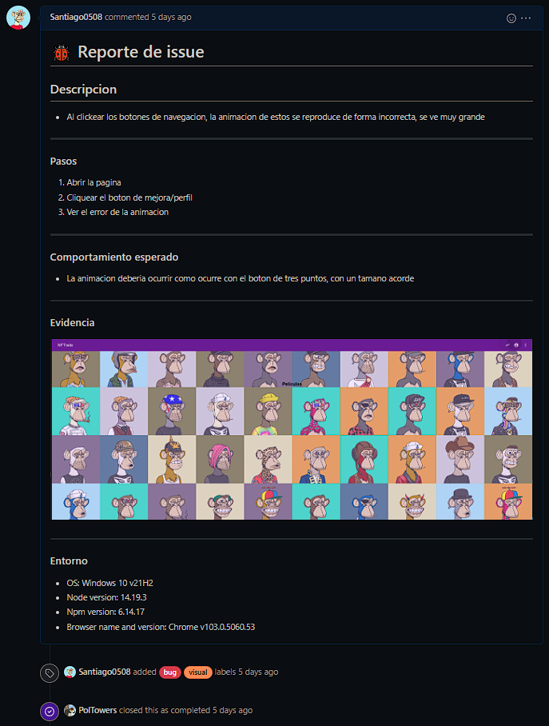

# Informe académico entrega 2
Fecha de entrega: 27-jun-2022

## Construcción

### Implementación de funciones principales

Comenzamos por pensar las clases que ibamos a precisar. Decidimos usar:
- NFT
- Collection: Lista de NFTs
- User: Usuario que tiene una colección de NFTs
- System: Sistema donde se encuentran los usuarios

Cada NFT tiene su propio id, imagen y precio. Los NFTs se encuentran en una colección, la cual es una lista de NFTs perteneciente a un usuario. Esta puede recibir NFTs, removerlos, y retornar su contenido. A su vez, los usuarios cuentan con un id además de su colección. Estos pueden recibir NFTs de otros usuarios (intercambiar), y retornar su colección. Por último, el sistema figura por encima de todo y contiene una lista de usuarios. Esta se puede modificar agregando nuevos usuarios.

### Configuración de plataforma tecnológica para desarrollo y producción

Siguiendo el estandar de material.io, decidimos usar nodejs, npm, y webpack para la construcción de la plataforma. 

### Documentación del uso de librerías externas

No usamos ninguna librería externa.

## Interfaz de usuario

### Interfaz de usuario web / mobile (responsive)

No se pudo lograr que la aplicación sea responsive al cambiar el tamaño del display del usuario final.

### Página única con navegación entre secciones

Se utilizo una top-app-bar para poder navegar entre las funciones de la página, adaptamos el estilo del template a los colores que definimos en el boceto, adicionando botones con íconos de material design en lugar de usar botones con texto y agregando funcionalidad de botón al titulo de la app para volver a la página principal.

### Implementación: Material Design Web Components

A través del desarrollo de la aplicación ultilizamos algunos componentes de Material Design:

- ```Top App Bar```: En donde se encuentra el título y los botones para navegar entre secciones. 

- ```Button```: Se usaron buttons con íconos para cambiar de secciones en la aplicación y un button sin relieve para volver a la pagina principal

### Aplicar un sistema de diseño

El sistema de diseño aplicado fue Material Design de Google, el cual está inspirado en el mundo físico y sus texturas, como las sombras que producen o la luz que reflejan en dicho entorno.
 
### Principios de usabilidad y cumplimiento de estándar de accesibilidad WCAG

Debido al mal manejo de tiempo y a la subestimación del alcance del proyecto no pudimos cumplir con una gran cantidad de items que se solicitaron en el proyecto, y por consecuencia no pudimos imponer principios de usabilidad en el proyecto ni cumplir con WCAG.

### Seguir especificación de estilo

El título de la aplicación se cambio a uno que estaba acorde con las funciones que queriamos aplicar. Se definió un color principal y secundario que se puede observar en la página.

## Codificación

### IDE Visual Studio Code: configuración común del equipo

Decidimos usar una versión de node específica (v14.18.1) para que generara la misma carpeta de node_modules, ya que a veces aparecían errores al levantar la aplicación si se usaban versiones diferentes.
Usamos el formatter default de HTML ya que Prettier indentaba las etiquetas de forma confusa.

### Estándares de codificación Google (HTML, CSS, JavaScript)

No se llegó a usar ESlint ni javadoc debido al manejo del tiempo explicado anteriormente.

### Buenas prácticas de OOP: separación de lógica e interfaz

Desde el principio del desarrollo se separó la parte de manejo de clases y pruebas en dominio (mjs test.js) y la parte visual en interfaz (HTML scss js).

En intefaz se importaron los archivos de dominio para poder usarse de acuerdo a las funciones de la página.

## Test unitario

Se corrieron las pruebas sobre el sistema, donde pasaron 13 casos de 14. El caso de prueba que falló fue el de agregar un usuario al sistema ya que fue omitido un "let".



## Test de sistema

### Realizar test de sistema en un entorno separado del desarrollo

Realizamos las pruebas de sistema en un entorno separado del desarrollo al hacerlo despues del code freeze, probando el codigo final.

### Generar casos de prueba aplicando técnica partición equivalente

Nuestro sistema está pensado para que el usuario no tenga que ingresar nada. Este comenzará logueado y con una colección con NFTs predeterminados. Este no tendrá impacto en su id, precio, etc., por lo cual no se establecieron chequeos internos para estos datos. Para efectos del ejercicio, se supondrá que el usuario puediese cambiar estos valores.

| Variable | Clases validas | Clases invalidas |
| :-: | - | - |
| nft.id | Número natural menor a 4294967296 (32 bits) | Campo vacio, valores no numericos, valores numericos menores a 0, valores numericos mayores a 4294967295, valores numericos con coma. |
| nft.price | Valor numerico positivo expresable con un punto flotante de 64 bits | Campo vacio, valores no numericos, valores numericos menores a 0, valores numericos no expresables con un punto flotante de 64 bits. |
| nft.image | Imagen formato .png con dimensiones menores o iguales a 1080x1080 | Campo vacio, archivos que no sean imagenes, imagenes con dimensiones que excedan a 1080 en cualquiera de sus ejes. |


## Reporte de issues

### Reportar issues (bugs, improvements, missing features) en GitHub 



### Aplicar buenas prácticas de reporte de issues



### Definir labels para tipos de issue y niveles de severidad

Para organizarnos usamos las labels default de GitHub, y además definimos labels para bugs visuales o funcionales.

### Sumarizar número de issues reportados por tipo

Reportamos dos issues visuales.

### Realizar una evaluación global de la calidad

Dado el estado del proyecto, no es posible evaluar la calidad del mismo.

## Reflexión

**Pablo**

Personalmente tenía grandes expectativas con esta parte del trabajo ya que quería mezclar los conceptos que expusimos en la primera parte del obligatorio; subestimé la curva de aprendizaje del uso de Material Design, pasamos varios días de la recta final intentando descifrar cómo configurar los archivos para que la página pudiera levantar (cuando pudimos haber experimentado antes), dejándonos menos tiempo para poder implementar todo lo pedido por la letra y lo planteado en nuestro proyecto. Tuvimos varios problemas con git(que se pueden ver reflejados en los commits) que nos restaron aún mas tiempo.


Dejando eso de lado, nos dividimos las tareas eficientemente y nos ayudábamos mutuamente cuando podíamos. Pudimos mantener el mismo rumbo de pensamiento a la hora de mejorar de la implementación.

**Santiago**

Me quede disconforme con material.io, ya que nos retrasó varios días, lo cual se arrastró hasta el fin del proceso. A pesar de estar emocionado por nuestra idea, sentí que las herramientas nos tiraron para atrás mucho más de lo que nos ayudaron. Por su lado, git nos pareció muy útil y va a formar parte de futuros proyectos. Me quedo con la lección de no confiar en herramientas que no conozca y dedicarle mucho más tiempo a explorarlas y solucionar sus problemas antes de empezar con cualquier proyecto.

### Técnicas aplicadas y aprendizajes


